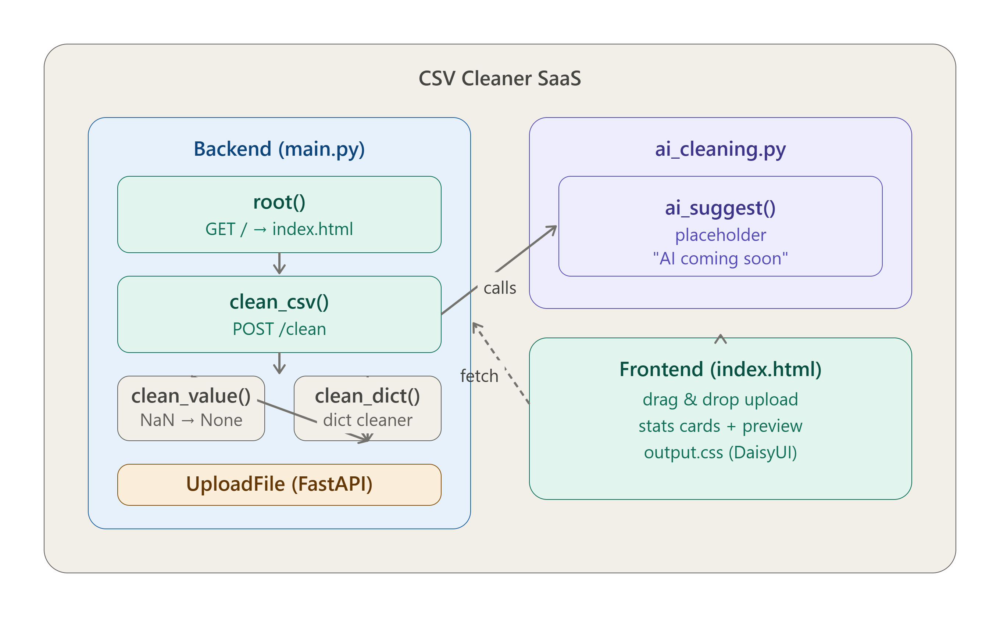

# 🧹 CSV Cleaner SaaS

**فارسی** | **English**

---

## فارسی

ابزار پاک‌سازی خودکار فایل‌های CSV — ساخته شده با Python و FastAPI.

### ویژگی‌ها

- حذف ردیف‌های تکراری
- حذف ردیف‌های خالی
- نرمال‌سازی نام ستون‌ها
- نمایش گزارش تغییرات
- پیش‌نمایش داده تمیز
- دانلود CSV تمیز شده
- پشتیبانی از AI (به زودی)

### معماری پروژه



### نصب و راه‌اندازی

**۱ — clone کن:**
```bash
git clone https://github.com/Hosseinamiri850/Project-CSV-Cleaner-SaaS.git
cd Project-CSV-Cleaner-SaaS
```

**۲ — virtualenv بساز:**
```bash
python -m venv venv

# Windows
venv\Scripts\activate

# Mac/Linux
source venv/bin/activate
```

**۳ — packages نصب کن:**
```bash
pip install -r requirements.txt
```

**۴ — فایل `.env` بساز:**
```
ANTHROPIC_API_KEY=sk-ant-xxxxx   # اختیاری
GEMINI_API_KEY=AIza-xxxxx        # اختیاری
```

**۵ — سرور رو بالا بیار:**
```bash
uvicorn main:app --reload
```

**۶ — برو به:**
```
http://127.0.0.1:8000
```

### ساختار پروژه

```
Project-CSV-Cleaner-SaaS/
├── main.py              # FastAPI backend
├── ai_cleaning.py       # AI integration
├── requirements.txt     # Python dependencies
├── .env                 # API keys (گیت نمیگیره)
├── .gitignore
├── docs/
│   └── csv_cleaner_structure.png
└── frontend/
    └── src/
        ├── index.html   # UI
        ├── input.css    # Tailwind input
        └── output.css   # CSS build شده
```

### API

#### `POST /clean`

**Request:**
```
Content-Type: multipart/form-data
file: <csv file>
```

**Response:**
```json
{
  "report": {
    "rows_before": 5,
    "rows_after": 3,
    "duplicates": 1,
    "nulls": {"name": 1, "email": 1}
  },
  "ai_notes": "...",
  "preview": {...},
  "csv": "name,email,age\n..."
}
```

---

## English

An automated CSV cleaning tool built with Python and FastAPI.

### Architecture


### Features

- Remove duplicate rows
- Remove empty rows
- Normalize column names
- Cleaning report with stats
- Clean data preview
- Download cleaned CSV
- AI-powered suggestions (coming soon)

### Stack

- **Backend**: FastAPI + Python
- **Data Processing**: pandas
- **Frontend**: HTML + DaisyUI + Tailwind CSS
- **AI**: Gemini / Anthropic (disabled — coming soon)

### Installation

**1 — Clone the repo:**
```bash
git clone https://github.com/Hosseinamiri850/Project-CSV-Cleaner-SaaS.git
cd Project-CSV-Cleaner-SaaS
```

**2 — Create virtualenv:**
```bash
python -m venv venv

# Windows
venv\Scripts\activate

# Mac/Linux
source venv/bin/activate
```

**3 — Install packages:**
```bash
pip install -r requirements.txt
```

**4 — Create `.env` file:**
```
ANTHROPIC_API_KEY=sk-ant-xxxxx   # optional
GEMINI_API_KEY=AIza-xxxxx        # optional
```

**5 — Start the server:**
```bash
uvicorn main:app --reload
```

**6 — Open in browser:**
```
http://127.0.0.1:8000
```

### Project Structure

```
Project-CSV-Cleaner-SaaS/
├── main.py              # FastAPI backend
├── ai_cleaning.py       # AI integration
├── requirements.txt     # Python dependencies
├── .env                 # API keys (not tracked by git)
├── .gitignore
├── docs/
│   └── csv_cleaner_structure.png
└── frontend/
    └── src/
        ├── index.html   # UI
        ├── input.css    # Tailwind input
        └── output.css   # Built CSS
```

### API Reference

#### `POST /clean`

**Request:**
```
Content-Type: multipart/form-data
file: <csv file>
```

**Response:**
```json
{
  "report": {
    "rows_before": 5,
    "rows_after": 3,
    "duplicates": 1,
    "nulls": {"name": 1, "email": 1}
  },
  "ai_notes": "...",
  "preview": {...},
  "csv": "name,email,age\n..."
}
```

### Deploy on Railway

1. Push code to GitHub
2. Go to [railway.app](https://railway.app)
3. New Project → Deploy from GitHub
4. Add environment variables
5. Done!

## License

MIT
